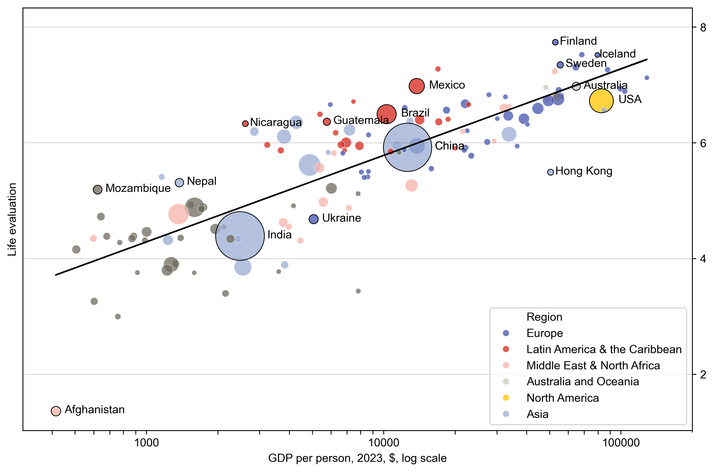
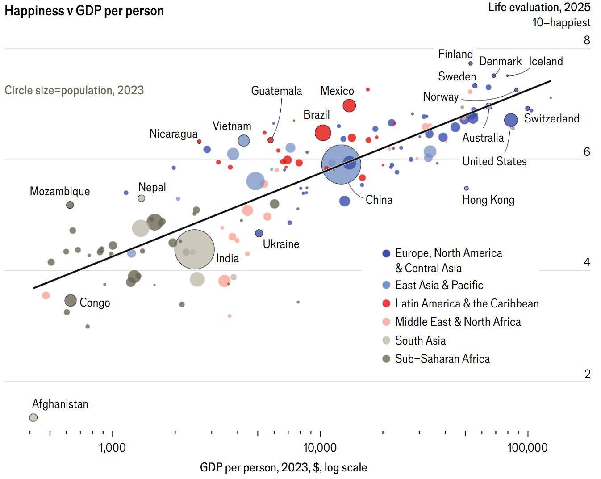

# World Happiness Report: Replicating a Visualisation from The Economist

In this project, I recreated a published data visualisation from The Economist to showcase my skills in visual communication, technical replication, and storytelling through charts. The goal was not to draw new conclusions from the data, but to reverse-engineer a professional-level chart using the raw data behind it—and, in doing so, better understand what makes a visualisation clear, compelling, and trustworthy.

#### The Data & The Findings
- The ***World Happiness Report***, is based on a survey run by Gallup. It asks participants from around the world to rate their lives out of 10.
- We can see a correlation between GDP and the Life Evaluation score as reported on the survey.
- Countries are plotted with circle size indicating population with colour used to group countries by geographical region.
- This gives the noteworthy insight that Latin American countries tend to appear above the trendline; happier than would be expected for their given GDP.

## Work flow

**Data Collection**

- To begin with, I needed to find the data used by The Economist to make this visual. Thankfully, they’d referenced this in their graphic. The survey was conducted by Gallup, whose site hosted a simple report with a Life Evaluation Score for each country. Supplementary data was pulled from the World Bank (for data on population and GDP as of 2023).

**Cleaning**

- Initial inspections of the files revealed a need for some data cleaning.
- First of all, naming conventions for certain countries differed between files. Variations on names were replaced with more convenient and consistent names. For example, 'United States of America' and 'United States' became 'USA' and entries for 'United Kingdom' or 'United Kingdom of Great Britain and Northern Ireland’ became 'UK'. These simplifications would both be useful in annotating the visualisation later on.
- Numeric values had commas removed and had their data type converted to float.
- Next was missing data. For this project, which specifically focussed on reverse-engineering the data visualisation skills, it was simplest to remove any countries missing population or GDP data for 2023. This meant a few smaller countries missing in the final visual.
- Lastly, the files could be merged into one dataframe.

**Visualisation**

- The graphic from The Economist is an advanced scatterplot. In replicating it, I had to add a few crucial details:
- I created a log scale x-axis. Including creating correctly spaced and labelled tick-marks, and a trendline using log GDP values.
- I set-up a custom colour palette using the same HEX colour codes as the original to differentiate geographical regions.
- Whereas The Economist has manually annotated several countries on-top of their graphic, I precisely annotated a select number of highlighted data points in-code, plotted with a slight offset for clarity, proportionate with the size of each plot.
- Lots of other little tweaks helped mirror the original graphic. Tinkering with the transparency of plots, and thus the HEX codes. Amending the zoom and size of the plot.

So finally, here is the comparison; my graph again along with the original. How do you think I did?

[Link to the Economist article](https://www.economist.com/graphic-detail/2025/03/20/lessons-from-the-happiest-countries-in-the-world "The Economist") 
(note pay wall).